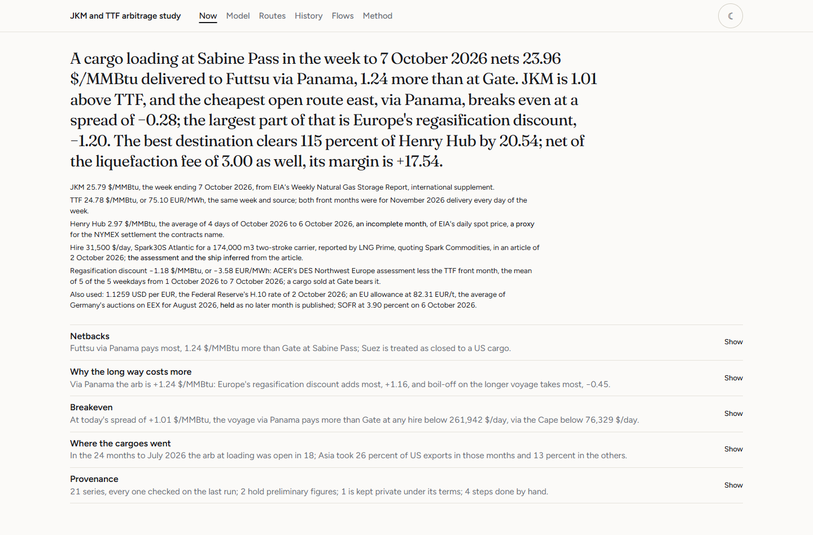

# JKM and TTF arbitrage study

> Prices a US Gulf LNG cargo into Northwest Europe and Northeast Asia, net of
> liquefaction, freight, boil-off, canal routing and regasification, and finds
> the JKM-TTF spread at which cargoes reroute east and when the arb closes.

**Live site:** https://nathancouturier.github.io/jkm-ttf-arbitrage/

A cargo loads at Sabine Pass. It can be sold at Gate, in Rotterdam, against
TTF, or at Futtsu, in Tokyo Bay, against JKM, by Panama, by Suez or round the
Cape of Good Hope. The study prices every leg of that choice from public data,
finds the spread of JKM over TTF at which each route east pays as much as Gate,
and checks the result against where US cargoes went.

---

## What the study cannot do

Read this part first.

- **It forecasts nothing and trades nothing.** No signal, no position, no
  profit and loss, no Sharpe ratio. Every figure is a cargo priced on a day
  that has passed, or on the latest day the data hold.
- **It shows an association, not a decision.** Over 115 months from February
  2016 to July 2026, a dollar more of arb east at loading went with 1.7 points
  more of US exports by vessel going to Asia, at a t statistic of 2.3 with
  Newey-West errors, and an R squared of 0.11. Without 2020, 2022 and 2026 the
  slope is 5.3 points and R squared 0.25. Long term contracts, Panama's slots,
  China's tariff on US LNG from February 2025 and the cost of a ship already
  chartered also move cargoes, and the test cannot separate them.
- **Charter rates are sparse.** The study holds ten rates, reported by Spark
  and the trade press, each dated by the day it refers to or, where the
  article gives none, by the article's date. Every date is worked at the
  lowest, the median and the highest of them, and at the one reported nearest
  it where one lies within 14 days, never at a rate made up for it.
- **The engine adds no wait at Panama.** The Flows view sets Panama against
  the Cape with the 12 and 15 days reported for LNG in July and December 2023
  only; every other restriction is drawn on the timeline, and any wait or slot
  premium is for the reader to type.
- **"Suez closed to a US cargo" is an absence of reports.** No source read
  shows a US Gulf cargo through the Red Sea after 12 January 2024; the study
  treats the route as closed from the next day and says so wherever it does.
- **Before April 2021 the monthly JKM is a Japanese spot price**, METI's
  contract-based figure, a proxy, and from April to August 2021 no public JKM
  is held: JOGMEC's continuation of the survey cannot be redistributed.
- **Port costs are Spark's figures of February 2022**, held for every year and
  both ships, because no public source prices one port alone for an LNG
  carrier.
- **The body face is not the portfolio's.** The portfolio sets Satoshi, whose
  licence forbids serving it from a repository; this site sets Figtree, the
  openly licensed face closest to it.

## What it does

- **Netbacks at Sabine Pass by route.** Gate at TTF plus Europe's DES spread,
  observed from ACER where it publishes and labelled an assumption elsewhere;
  Futtsu at JKM by Panama, Suez and the Cape. Round trip hire, boil-off on
  every day of the voyage, ports, canal tolls priced on each transit's own day,
  the EU ETS on the voyage into Europe, and the financing of the cargo.
- **The breakeven spread S\* per route, in closed form**, split into the gas
  the longer voyage burns, the DES spread a cargo sold east escapes, and the
  voyage's extra cost; and the breakeven hire H\*, the charter rate at which
  the route stops paying.
- **When the arb closes, both ways.** The arb east closes when the spread
  falls below S\*; the US export arb closes when the best netback falls below
  115 percent of Henry Hub, which the study tests month by month through 2020,
  at loading and at the date the notice to cancel was due, against the cargoes
  EIA reported cancelled.
- **A calculator that is the engine.** Every input editable, presets from the
  data of their dates, the landing sentence recomposed as you type.
  `src/engine.js` mirrors `src/lngarb/engine.py` and is held to it to 1e-9 on
  254 cases, and the calculator's own handling of edits is held to its Python
  reading on 23 named edits.
- **Routes, history and flows.** A map of the four routes drawn from the
  lines their distances are measured on, with when each was open to a US
  cargo, band by band with its source; every week since September 2021 and
  every month since 2016 against the breakeven of the cheapest route; and the
  share of US exports to Asia against the arb.
- **Provenance for every number.** Every series with its publisher, terms,
  last fetch, gaps and vintage, and the work the pipeline cannot do itself.

---

## The site



Six views: **Now**, the latest week; **Model**, the calculator; **Routes**;
**History**; **Flows**; and **Method**, every formula and parameter with its
source. Screenshots of every view, at widths from 1440 to 320 pixels and in
both themes, are in [`assets/`](assets/).

---

## Running it locally

There is no build step, no framework and no install for the site: plain HTML,
ES modules and CSS reading JSON out of `data/`.

```
git clone https://github.com/nathancouturier/jkm-ttf-arbitrage.git
cd jkm-ttf-arbitrage
python scripts/serve.py --port 8131
```

Then open **http://localhost:8131/jkm-ttf-arbitrage/**, with the subpath and the
trailing slash. `scripts/serve.py` uses the standard library only and serves
the repository at the subpath the live site uses, answering 404 everywhere
else, so a path that would break the deploy breaks here first.

For the pipeline and the checks, install the pinned Python dependencies once:

```
python -m pip install -e ".[dev]"
make gate
```

| Command | What it does |
|---|---|
| `python scripts/refresh.py --offline` | Revalidates every committed cache against `data/manifest.json`, with no network. |
| `python -m pytest tests` | The suite: units, the engine's anchors, Spark's worked examples, every source adapter against committed fixtures, and every count the site's sentences give, recounted. |
| `PYTHONPATH=src python -m lngarb.export` | Writes the seven JSON files the site reads, from the committed data. |
| `PYTHONPATH=src python -m lngarb.versions` | Writes the content hashes of every file the page loads into `index.html`. |
| `node tools/validate-data.mjs` | The data layer: schemas, dates, nothing private tracked, no dashes, no stray traces. |
| `node tools/validate-engine.mjs` | `src/engine.js` against the Python on every case of `data/fixtures/engine-cases.json`, the presets and the named edits. |
| `node tools/validate-artifacts.mjs` | Every artifact the page reads, against what the page reads from it. |
| `node tools/check-paths.mjs` | Every path relative, so the subpath deploy works. |
| `node tools/check-literals.mjs` | No number in the frontend that no artifact supplied. |
| `node tools/check-styles.mjs` | The stylesheets against the portfolio's design system. |

Two more need a browser and the local server running, so they sit outside the
gate, in `make site`: `node tools/check-model-form.mjs`, which drives the
calculator's form in headless Chromium, and `node scripts/screenshots.mjs`,
which writes the Now view at desktop and phone widths in both themes, and every
other view at four widths from 1440 to 320 pixels, into `assets/`.

---

## Refreshing the data

```
python scripts/refresh.py                    every job
python scripts/refresh.py --only eia-weekly  one job; --list names them
```

A failed fetch keeps the old cache and marks the series failed; nothing is
ever filled in. `.github/workflows/refresh.yml` runs the public jobs on
Thursday evening, after EIA's release, and again on Friday, rebuilds the
artifacts and runs the gate; it commits and publishes only if everything
passes, and opens an issue if anything fails.

### The manual steps

Four steps the pipeline cannot do for itself, which `lngarb.manual_steps`
records with what is lost without each:

1. **EIA's archived Weekly Update issues**, read from the Internet Archive's
   captures and kept privately.
2. **The WNGSR Supplement**, whose current issue is the only one readable by
   code: it has to be collected every week, after the Thursday release.
3. **ACER's daily assessments**, whose history is a download from its TERMINAL
   platform, saved by hand.
4. **METI's monthly releases**, one PDF per month from 2014 to 2021, saved from
   a browser for the preliminary figures.

---

## Provenance

| Series | Publisher | Terms | In this repository |
|---|---|---|---|
| Weekly JKM and TTF, Natural Gas Weekly Update and WNGSR Supplement | U.S. Energy Information Administration, figures credited to Bloomberg | EIA's public domain; for figures EIA credits to Bloomberg, an open question | yes |
| Henry Hub spot, daily | U.S. Energy Information Administration, credited to Refinitiv | EIA's public domain; for figures EIA credits to Refinitiv, an open question | yes |
| US LNG exports by destination, and their revisions | U.S. Energy Information Administration | US public domain | yes |
| US LNG exports cargo by cargo | U.S. Department of Energy | US public domain | yes |
| DES LNG assessments for Northwest Europe and the EU benchmark | European Union Agency for the Cooperation of Energy Regulators | reproduction with acknowledgement, on this study's reading, an open question | yes |
| Japan spot LNG price, monthly, to March 2021 | Ministry of Economy, Trade and Industry of Japan | compatible with CC BY 4.0 | yes |
| Japan spot LNG price, monthly, from April 2021 | Japan Organization for Metals and Energy Security | permission not granted | no, private |
| Pink Sheet gas prices, monthly, and their revisions | The World Bank | CC BY 4.0 | yes |
| EU allowance price, monthly | European Commission; after June 2025, DEHSt's German auctions on EEX | CC BY 4.0; CC BY-NC-ND 4.0 | yes |
| US dollars per euro, daily | Federal Reserve Board, H.10 | US public domain | yes |
| SOFR, and EFFR before it, daily | Federal Reserve Bank of New York | New York Fed Terms of Use | yes |
| US dollars per SDR, daily | International Monetary Fund, through the Deutsche Bundesbank | IMF terms, with attribution | yes |
| Reported charter rates | this study, from Spark Commodities, LNG Prime and Hellenic Shipping News | the publishers' terms forbid republishing their articles; only the figures and their sources are kept | yes |
| The four sea routes | this study, with searoute over Eurostat's SeaRoute network | distances MIT; lines EUPL 1.2 | yes |

Every series' terms, quoted in its publisher's own words, and every trap met
in reading it, are in [`docs/sources.md`](docs/sources.md); the site's
Provenance section lists each with its last fetch and its gaps.

---

## Documents

- [`docs/methodology.md`](docs/methodology.md): every formula, every rule,
  every date the routes and the data change.
- [`docs/sources.md`](docs/sources.md): every source, its terms and its traps.
- [`docs/open-questions.md`](docs/open-questions.md): what is left open, and
  why.

## Licences

The code, and the figures this study computes itself, are under the MIT
licence in [`LICENSE`](LICENSE). Data published by others keep their
publishers' terms, set out in [`NOTICE`](NOTICE): the route lines are under the
European Union Public Licence 1.2 as a work derived from Eurostat's SeaRoute
network, and the fonts and the land outlines in `vendor/` carry their own
licences beside them.

## Credits

- U.S. Energy Information Administration, which credits the weekly prices to
  Bloomberg Finance L.P. and the Henry Hub spot price to Refinitiv, an LSEG
  business; U.S. Department of Energy.
- European Union Agency for the Cooperation of Energy Regulators (ACER).
- Created by processing the information in the Spot LNG Price Statistics
  (Ministry of Economy, Trade and Industry of Japan).
- The World Bank, Commodity Price Data (The Pink Sheet), CC BY 4.0. The World
  Bank does not endorse this study.
- European Commission auction reports, CC BY 4.0; Source: EEX, DEHSt, CC BY-NC-ND
  4.0, the monthly averages reproduced unchanged.
- Board of Governors of the Federal Reserve System; the Federal Reserve Bank of
  New York, whose notice on SOFR and EFFR is in `NOTICE`.
- International Monetary Fund, exchange rate data, through the Deutsche
  Bundesbank.
- Spark Commodities, LNG Prime and Hellenic Shipping News, for the charter
  rates each figure names; Platts, through the publications that republished
  its counts.
- searoute (Apache License 2.0) and Eurostat's SeaRoute network (EUPL 1.2), for
  the sea routes.
- Natural Earth, public domain, through the world-atlas package (ISC), for the
  land.
- Fraunces, Figtree and JetBrains Mono, under the SIL Open Font License.
